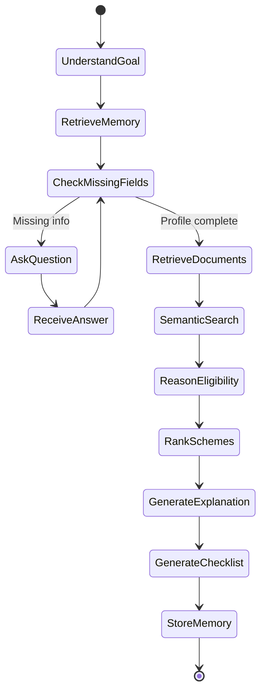

# 🏛️ GOVs-AI: AI-Powered Government Scheme Eligibility Platform

> **Startup-Ready SaaS Platform for Government Welfare Scheme Discovery & Personalized Eligibility Assessment.**

GOVs-AI bridges the gap between complex government bureaucracy and the citizens who need it most. By combining stateful **LangGraph AI Agents**, a local **FAISS Retrieval-Augmented Generation (RAG) pipeline**, and a responsive **Glassmorphism dashboard**, GOVs-AI enables citizens to discover, evaluate, and apply for government schemes through simple conversational profiling.

---

## 📖 Project Overview

### Problem Statement
Indian government welfare schemes are highly beneficial but notoriously hard to navigate. Citizens face fragmented portals, obscure eligibility language, and complex documentation requirements, leading to massive under-utilization of public funds. 

### Solution
GOVs-AI offers a one-stop conversational SaaS platform. An autonomous AI agent interacts with the user in natural language, builds a structured profile, queries a semantic index of official scheme guidelines, calculates an exact eligibility readiness score, and generates a personalized document checklist.

---

## ✨ Features

- **🧠 Conversational Profiling (AI Agent)**: A multi-turn conversational agent that collects user details naturally, eliminating complex form-filling.
- **🔍 Semantic Search & RAG**: Real-time PDF parsing and indexing using PyMuPDF and FAISS for accurate, grounded search queries.
- **📋 Document Checklist Generator**: Dynamically generates tailored application checklists, mapping user credentials to scheme rules.
- **📊 Interactive Readiness Dashboard**: Transparent analysis showing exactly why a user qualifies (or doesn't) with a gauge readiness score.
- **🌓 Dynamic Glassmorphism UI**: Beautiful, premium dark/light mode responsive layout inspired by professional SaaS platforms.
- **🔑 JWT-Based Security**: Role-based access control (Citizen vs. Admin) with password hashing and rate limiting.
- **🤖 Demo Personas**: Pre-loaded profiles (Farmer, Student, Woman Entrepreneur, Senior Citizen, Startup Founder) for instant demonstration.

---

## 🏗️ Architecture

```
                        USER (Citizen/Admin)
                                 │
                                 ▼
                       React Frontend (Vite)
                                 │
                                 ▼
                        FastAPI Backend API
                                 │
         ┌───────────────────────┼───────────────────────┐
         │                       │                       │
         ▼                       ▼                       ▼
   LangGraph Agent          SQLite Database       JSON Memory Store
         │
         ▼
   Tool Orchestrator
         │
 ┌───────┼───────────┬───────────┐
 ▼       ▼           ▼           ▼
Gemini  FAISS     PyMuPDF   Government PDFs
 API   Vector DB   Parser    Knowledge Base
         │
         ▼
  Eligibility Engine
         │
         ▼
 Recommendation Engine
         │
         ▼
Checklist + Dashboard + History
```

---

## 🛠️ Technology Stack

| Tier | Technology | Description |
|---|---|---|
| **Frontend** | React, TypeScript, Vite, Vanilla CSS | Fast, type-safe, sub-second dev server with custom Glassmorphic styling. |
| **Backend** | FastAPI, Uvicorn | High-performance, async-native Python web framework. |
| **Orchestration** | LangGraph, LangChain | Stateful multi-agent graph for planning and execution. |
| **Vector DB** | FAISS (local) | Fast similarity search for document chunk retrieval. |
| **Database** | SQLite + SQLAlchemy | Portable relational database storage for users, chats, and bookmarks. |
| **Parser & Models** | PyMuPDF, SentenceTransformers | Local PDF ingestion and lightweight text embedding (`all-MiniLM-L6-v2`). |

---

## ⚡ AI Agent Workflow

The LangGraph workflow implements a structured state machine:



1. **Understand Goal**: Classify intent (Greeting, Query, Eligibility, Compare, Checklist).
2. **Retrieve Memory**: Load profile metadata and conversational history summaries.
3. **Check Missing Fields**: Identify missing details necessary for scheme evaluation.
4. **Retrieve Documents**: Execute semantic search against FAISS index.
5. **Reason Eligibility**: Combine rules and LLM validation to compute suitability scores.
6. **Generate Checklist**: Map the required documents to user properties.
7. **Store Memory**: Summarize and update the conversation profile state.

---

## 📁 Folder Structure

```
GOVs-AI/
├── README.md
├── backend/
│   ├── main.py            # FastAPI main entry
│   ├── config.py          # App settings
│   ├── requirements.txt   # Backend dependencies
│   ├── api/               # API Router & Auth
│   ├── agents/            # LangGraph workflow & prompts
│   ├── database/          # SQLite models & connections
│   ├── rag/               # PDF chunking, embedding, & retriever
│   ├── memory/            # JSON memory store
│   └── data/              # Scheme dataset & demo profiles
└── frontend/
    ├── package.json       # Frontend dependencies
    ├── vite.config.ts     # Vite config
    └── src/               # React + TS code base
```

---

## 🚀 Installation & Running Locally

### Prerequisites
- Node.js (v18+)
- Python (v3.10+)

### 1. Backend Setup
1. Navigate to the backend directory:
   ```bash
   cd backend
   ```
2. Create and activate a virtual environment:
   ```bash
   python -m venv venv
   # On Windows:
   .\venv\Scripts\activate
   # On Unix:
   source venv/bin/activate
   ```
3. Install dependencies:
   ```bash
   pip install -r requirements.txt
   ```
4. Create a `.env` file from the template:
   ```env
   GEMINI_API_KEY=your-gemini-api-key
   JWT_SECRET=govsai-hackathon-secret-key-2026
   DATABASE_URL=sqlite:///./govsai.db
   ```
5. Run the server:
   ```bash
   python main.py
   ```

### 2. Frontend Setup
1. Navigate to the frontend directory:
   ```bash
   cd ../frontend
   ```
2. Install dependencies:
   ```bash
   npm install
   ```
3. Start the Vite development server:
   ```bash
   npm run dev
   ```
4. Open your browser and navigate to `http://localhost:5173`.

---

## 🔮 Future Scope
- **Direct Integration with API Setu / MyScheme API**: Pull official schemas dynamically.
- **Multilingual Voice Support**: Natural voice search in local dialects (Tamil, Telugu, Kannada, etc.).
- **Automatic Document Verification**: OCR scanning (Aadhaar, Income Certificates) for instant, automated profile updates.

---

## 📄 License
This project is licensed under the MIT License - see the LICENSE file for details.
